# Setting Up Your C# Development Environment

A streamlined development environment is key to an efficient and enjoyable coding experience. This guide introduces you to the installation and configuration of two leading C# Integrated Development Environments (IDEs): Visual Studio and Rider.

## Visual Studio: Getting Started

Microsoft's Visual Studio stands out as the premier IDE for C# and .NET development.

### Before You Begin
- Ensure you're running a Windows OS. Mac users can opt for [Visual Studio for Mac](https://visualstudio.microsoft.com/vs/mac/).
- Install the latest version of the [.NET SDK](https://dotnet.microsoft.com/download/dotnet).

### Setting Up Visual Studio

1. Head over to the [official Visual Studio download portal](https://visualstudio.microsoft.com/downloads/).
2. Opt for the edition that suits you. (The Community edition is free.)
3. Execute the installer.

#### Installing .NET
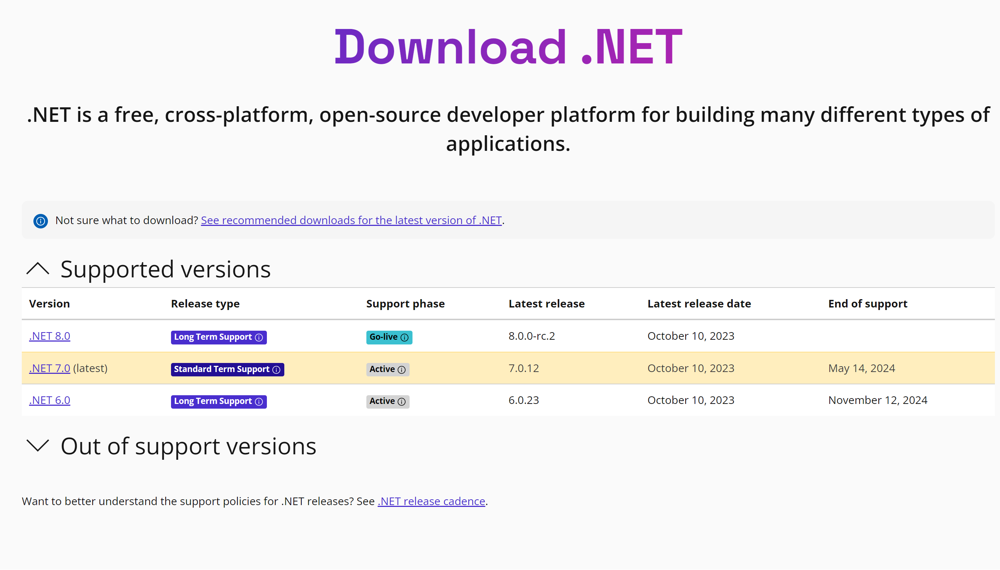
Ensure you choose the latest version.

#### Visual Studio Installation
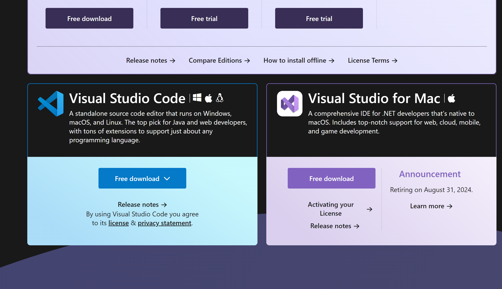
Select the highlighted option.

### Integrating Extensions
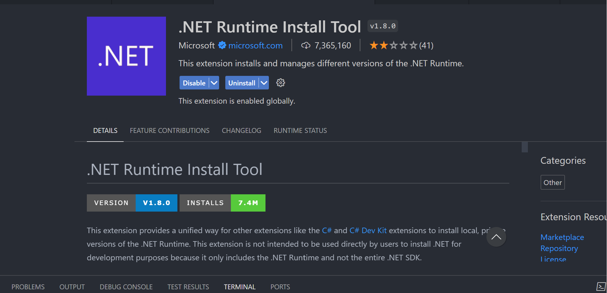
The .NET extension equips Visual Studio for C# development.

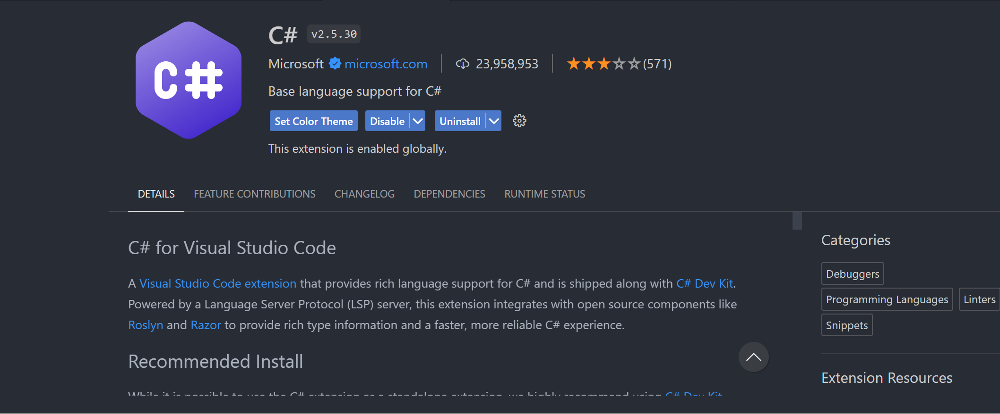
This C# extension enhances code readability.

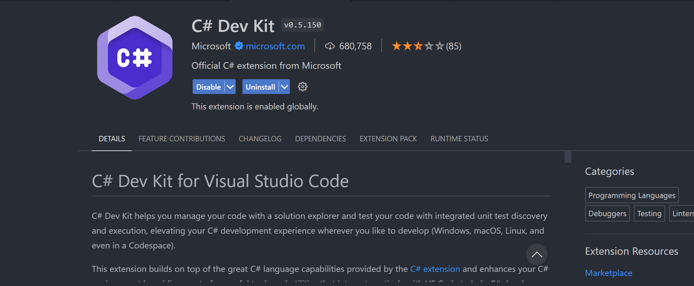
The C# Dev extension provides essential tools to make your code operational.

### Verifying Installation
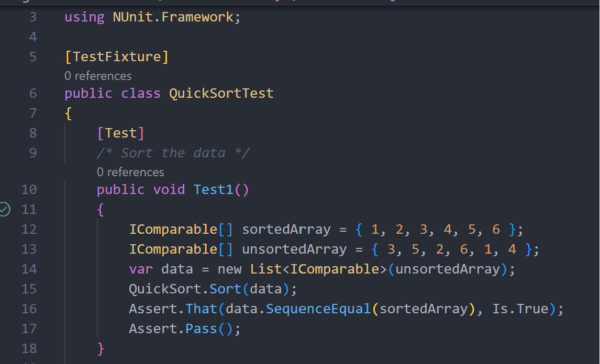
Open a project. If you spot a green play button as shown, you're all set!

---

## Rider: A Comprehensive Guide

JetBrains' Rider is a versatile cross-platform IDE, renowned for integrating the capabilities of ReSharper and the IntelliJ platform.

### Pre-installation Steps

- Compatible with Windows, macOS, and Linux.

### Installing Rider

1. Navigate to the [official Rider download page](https://www.jetbrains.com/rider/download/).
2. Secure the version matching your OS and proceed with installation.

#### Setup Steps
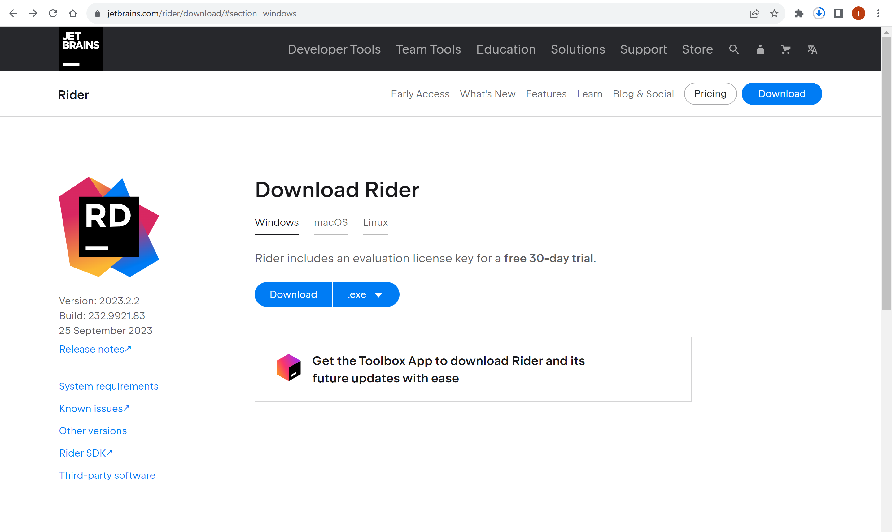
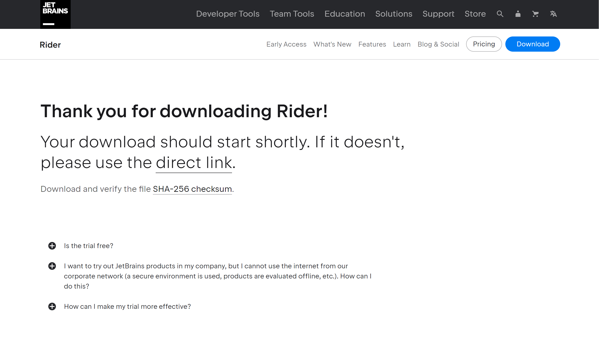
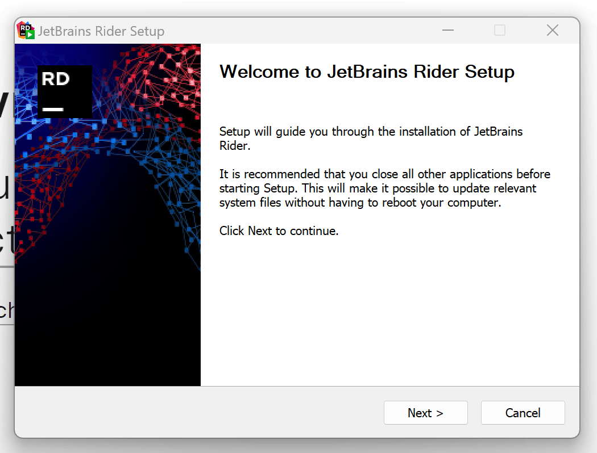
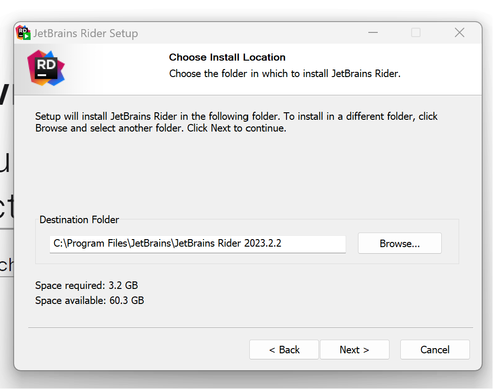
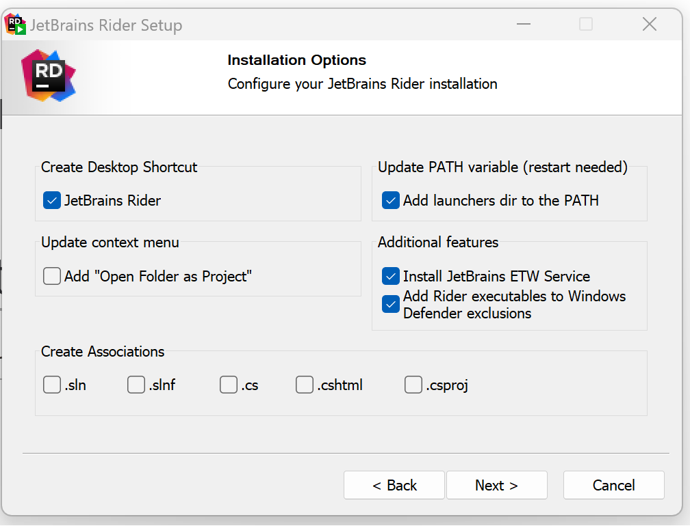
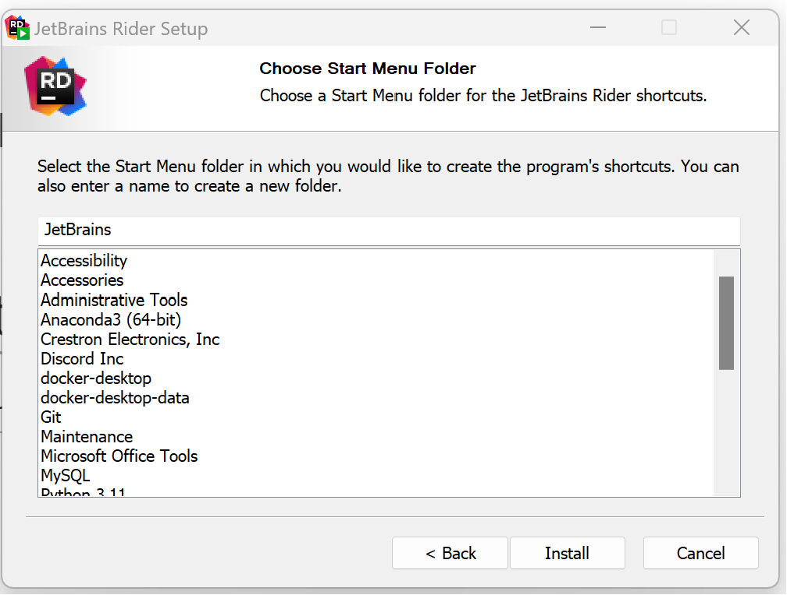
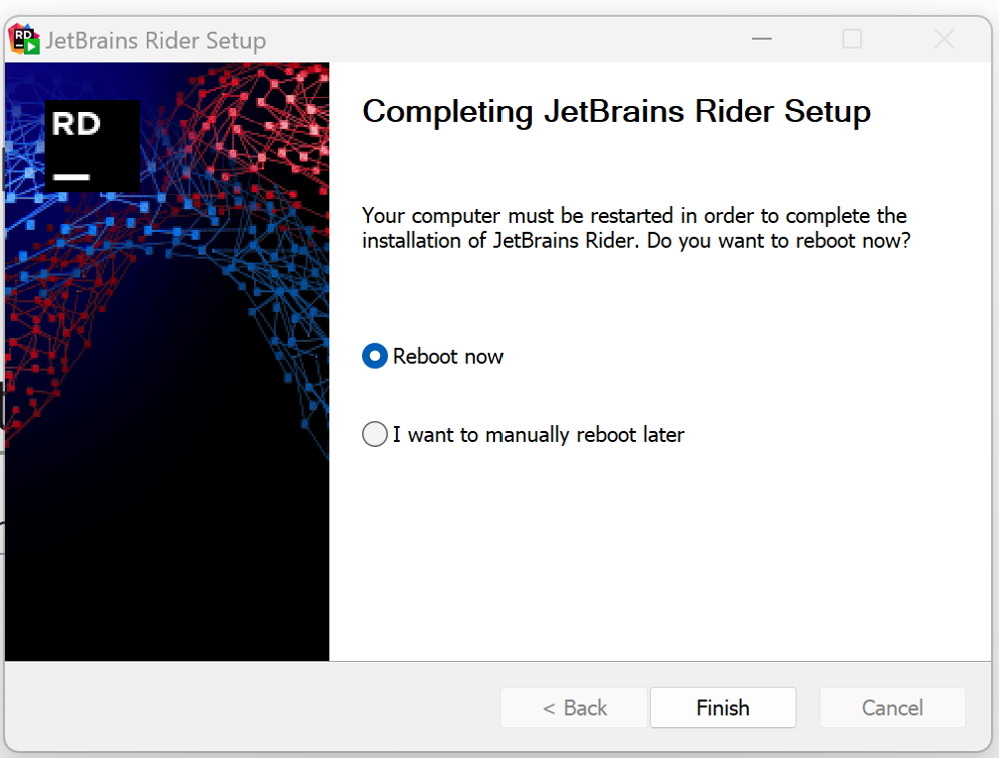

### Loading it 
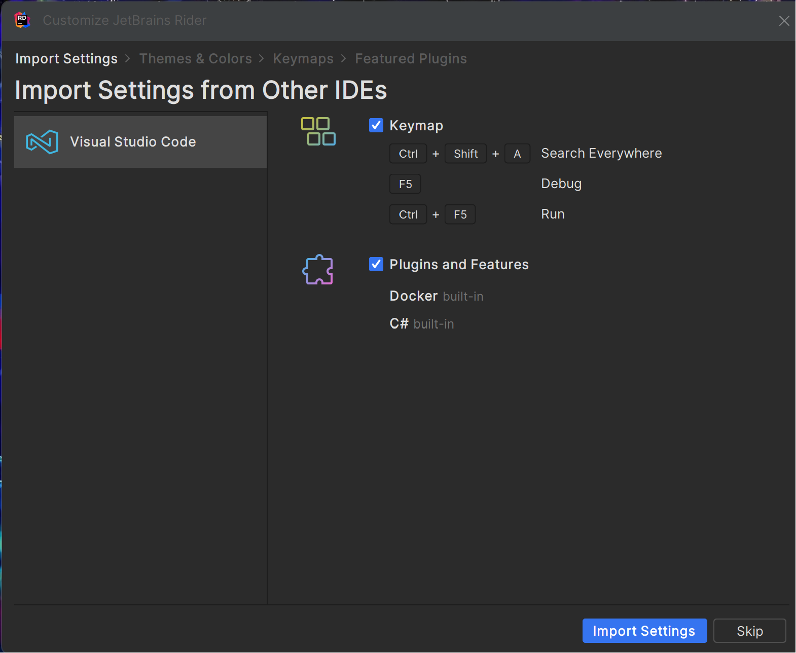
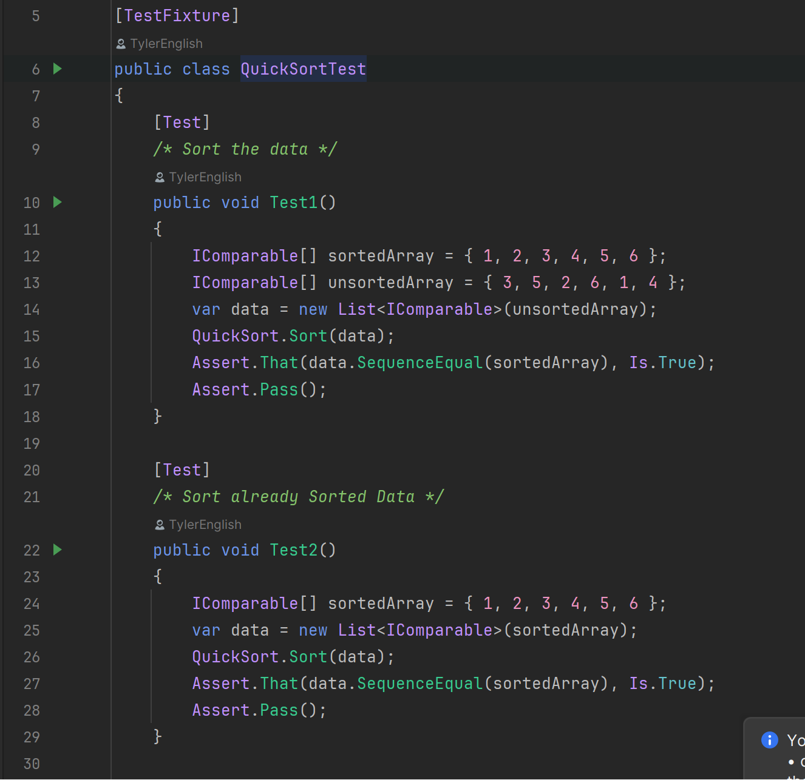
Ensure the green play button is visible.

### Utilizing a Student License

While Rider is a premium IDE, JetBrains generously offers it to students at no cost:

1. Sign up at the [JetBrains student portal](https://www.jetbrains.com/student/) using your university email.
2. Upon verification, you'll obtain a license activation key.
3. Boot up Rider and input the received key when prompted for activation.

---

To enjoy a seamless development experience, regularly update both IDEs, capturing the freshest features and essential security patches.
This revised version organizes information more systematically, making the guide easier to follow and more aesthetically appealing.
